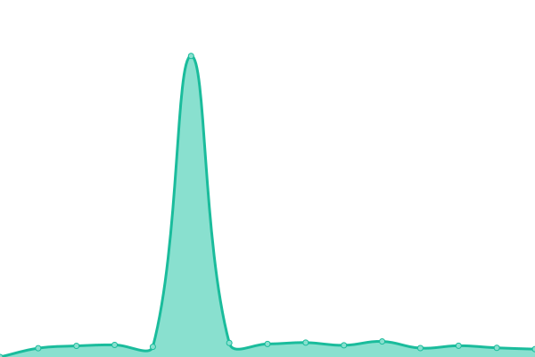
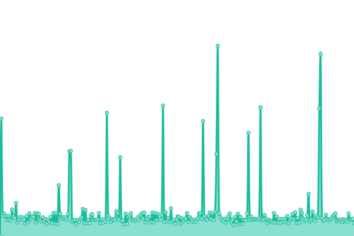
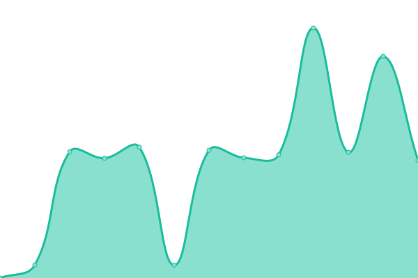
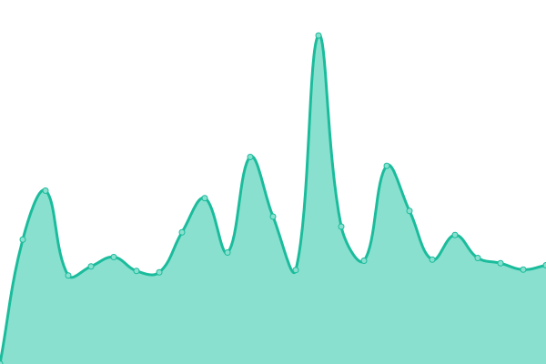
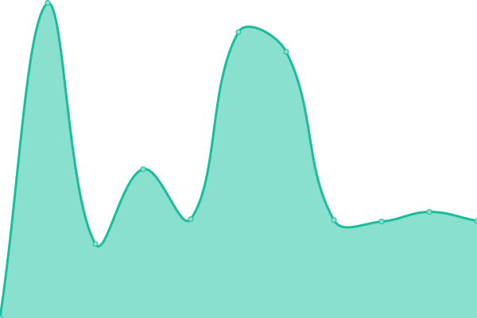

# [📈 Live Status](https://smart-assistant.github.io/gsm-upptime/): <!--live status--> **🟩 All systems operational**

This repository contains the open-source uptime monitor and status page for [smart-assistant](#), powered by [Upptime](https://github.com/upptime/upptime).

With [Upptime](https://upptime.js.org), you can get your own unlimited and free uptime monitor and status page, powered entirely by a GitHub repository. We use [Issues](https://github.com/smart-assistant/gsm-upptime/issues) as incident reports, [Actions](https://github.com/smart-assistant/gsm-upptime/actions) as uptime monitors, and [Pages](https://demo.upptime.js.org) for the status page.

<!--start: status pages-->
<!-- This summary is generated by Upptime (https://github.com/upptime/upptime) -->
<!-- Do not edit this manually, your changes will be overwritten -->
<!-- prettier-ignore -->
| URL | Status | History | Response Time | Uptime |
| --- | ------ | ------- | ------------- | ------ |
|  g s m - a p i - a z u r e | 🟩 Up | [g-s-m-a-p-i-a-z-u-r-e.yml](https://github.com/ivy-digital/gsm-upptime/commits/HEAD/history/g-s-m-a-p-i-a-z-u-r-e.yml) | 

 2958ms
     
 | 

<a href="https://ivy-digital.github.io/gsm-upptime/history/g-s-m-a-p-i-a-z-u-r-e">100.00%</a>
    

|  s t a - r i o - c l a r o | 🟩 Up | [s-t-a-r-i-o-c-l-a-r-o.yml](https://github.com/ivy-digital/gsm-upptime/commits/HEAD/history/s-t-a-r-i-o-c-l-a-r-o.yml) | 

 858ms
     
 | 

<a href="https://ivy-digital.github.io/gsm-upptime/history/s-t-a-r-i-o-c-l-a-r-o">100.00%</a>
    

|  s t a - t e r e z a | 🟩 Up | [s-t-a-t-e-r-e-z-a.yml](https://github.com/ivy-digital/gsm-upptime/commits/HEAD/history/s-t-a-t-e-r-e-z-a.yml) | 

 177ms
     
 | 

<a href="https://ivy-digital.github.io/gsm-upptime/history/s-t-a-t-e-r-e-z-a">100.00%</a>
    

|  s a s s o m | 🟩 Up | [s-a-s-s-o-m.yml](https://github.com/ivy-digital/gsm-upptime/commits/HEAD/history/s-a-s-s-o-m.yml) | 

 5242ms
     
 | 

<a href="https://ivy-digital.github.io/gsm-upptime/history/s-a-s-s-o-m">100.00%</a>
    

|  a l t e r | 🟩 Up | [a-l-t-e-r.yml](https://github.com/ivy-digital/gsm-upptime/commits/HEAD/history/a-l-t-e-r.yml) | 

 1294ms
     
 | 

<a href="https://ivy-digital.github.io/gsm-upptime/history/a-l-t-e-r">90.21%</a>
    

|  a l t e r V1 | 🟩 Up | [a-l-t-e-r-v1.yml](https://github.com/ivy-digital/gsm-upptime/commits/HEAD/history/a-l-t-e-r-v1.yml) | 

 254ms
     
 | 

<a href="https://ivy-digital.github.io/gsm-upptime/history/a-l-t-e-r-v1">59.64%</a>
    

|  a b a s | 🟩 Up | [a-b-a-s.yml](https://github.com/ivy-digital/gsm-upptime/commits/HEAD/history/a-b-a-s.yml) | 

 309ms
     
 | 

<a href="https://ivy-digital.github.io/gsm-upptime/history/a-b-a-s">100.00%</a>
    

|  h s a ú d e | 🟩 Up | [h-s-a-u-d-e.yml](https://github.com/ivy-digital/gsm-upptime/commits/HEAD/history/h-s-a-u-d-e.yml) | 

 5812ms
     
 | 

<a href="https://ivy-digital.github.io/gsm-upptime/history/h-s-a-u-d-e">100.00%</a>
    

|  s t a - i t a p e v a | 🟩 Up | [s-t-a-i-t-a-p-e-v-a.yml](https://github.com/ivy-digital/gsm-upptime/commits/HEAD/history/s-t-a-i-t-a-p-e-v-a.yml) | 

 421ms
     
 | 

<a href="https://ivy-digital.github.io/gsm-upptime/history/s-t-a-i-t-a-p-e-v-a">100.00%</a>
    

|  m a i s s a ú d e | 🟩 Up | [m-a-i-s-s-a-u-d-e.yml](https://github.com/ivy-digital/gsm-upptime/commits/HEAD/history/m-a-i-s-s-a-u-d-e.yml) | 

 292ms
     
 | 

<a href="https://ivy-digital.github.io/gsm-upptime/history/m-a-i-s-s-a-u-d-e">100.00%</a>
    

|  a m h a | 🟩 Up | [a-m-h-a.yml](https://github.com/ivy-digital/gsm-upptime/commits/HEAD/history/a-m-h-a.yml) | 

 1016ms
     
 | 

<a href="https://ivy-digital.github.io/gsm-upptime/history/a-m-h-a">99.82%</a>
    

|  i n t e r m e d i c i | 🟩 Up | [i-n-t-e-r-m-e-d-i-c-i.yml](https://github.com/ivy-digital/gsm-upptime/commits/HEAD/history/i-n-t-e-r-m-e-d-i-c-i.yml) | 

 574ms
     
 | 

<a href="https://ivy-digital.github.io/gsm-upptime/history/i-n-t-e-r-m-e-d-i-c-i">99.72%</a>
    

|  s e r m e d - o d o n to | 🟩 Up | [s-e-r-m-e-d-o-d-o-n-to.yml](https://github.com/ivy-digital/gsm-upptime/commits/HEAD/history/s-e-r-m-e-d-o-d-o-n-to.yml) | 

 1459ms
     
 | 

<a href="https://ivy-digital.github.io/gsm-upptime/history/s-e-r-m-e-d-o-d-o-n-to">100.00%</a>
    

<!--end: status pages-->

[**Visit our status website →**](https://smart-assistant.github.io/gsm-upptime)

## 📄 License

- Code: [MIT](./LICENSE) © [smart-assistant](#)
- Data in the `./history` directory: [Open Database License](https://opendatacommons.org/licenses/odbl/1-0/)
